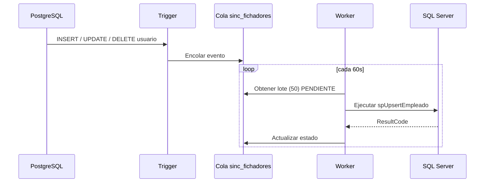

# Sincronización de usuarios

```mermaid
sequenceDiagram
participant DB as PostgreSQL
participant TR as Trigger
participant Q as Cola sinc_fichadores
participant W as Worker
participant SQL as SQL Server

DB->>TR: INSERT / UPDATE / DELETE usuario
TR->>Q: Encolar evento

loop cada 60s
W->>Q: Obtener lote (50) PENDIENTE
W->>SQL: Ejecutar spUpsertEmpleado
SQL-->>W: ResultCode
W->>Q: Actualizar estado
end
```